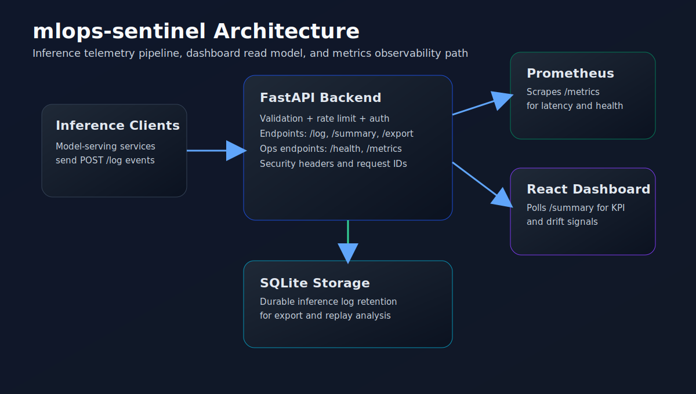
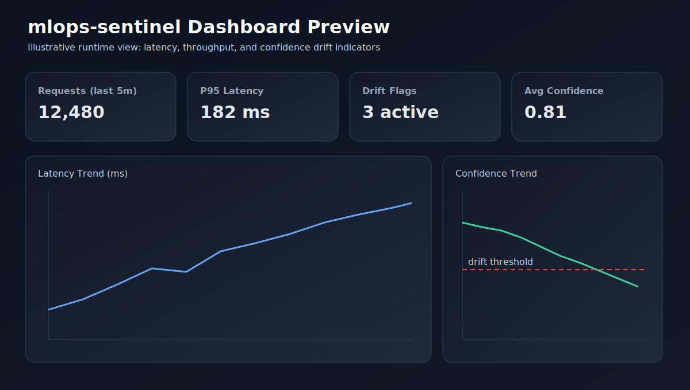

<!-- Generated by GitHub Copilot -->
# mlops-sentinel

Production-grade observability service for model inference traffic.


## What This Service Does

1. Ingests model inference events (`/log`).
2. Stores telemetry in SQLite for replay and export.
3. Exposes Prometheus metrics (`/metrics`).
4. Serves summary aggregates and drift signal (`/summary`).
5. Provides export APIs (`/export`) and health checks (`/health`).
6. Renders a live React dashboard for latency/distribution monitoring.

## Implemented Features

1. FastAPI backend with persistence, input validation, request IDs, and security headers.
2. Rate-limited ingestion path, optional API key auth, and configurable drift thresholding.
3. React dashboard with model filtering, KPI cards, and alert/error states.
4. Prometheus scrape compatibility and Docker Compose local stack.
5. Integration tests for core API flows.
6. Documentation baseline: API, deployment, testing, security, contributing, changelog.

## Quick Start

```bash
docker compose up
```

Then open:

1. API health: http://127.0.0.1:8000/health
2. Dashboard: http://127.0.0.1:4173
3. Prometheus: http://127.0.0.1:9090

## Visual Evidence

Architecture overview:



Dashboard preview:



## Service Endpoints

1. API: http://127.0.0.1:8000
2. Dashboard: http://127.0.0.1:4173
3. Prometheus: http://127.0.0.1:9090

## Local Development

Backend:

```bash
cd backend
# Python 3.12 is recommended for local setup.
python -m venv .venv
# Windows PowerShell: .\\.venv\\Scripts\\Activate.ps1
# macOS/Linux: source .venv/bin/activate
pip install -r requirements.txt
uvicorn app.main:app --reload --host 0.0.0.0 --port 8000
```

Optional backend security env vars:

```bash
MLOPS_API_KEY=
MLOPS_RATE_LIMIT_PER_MINUTE=600
```

Frontend:

```bash
cd frontend
npm ci
npm run dev -- --host 0.0.0.0 --port 4173
```

## Production Verification

Run these checks before release tags:

```bash
# backend
cd backend
python -m pip install --upgrade pip
pip install -r requirements.txt
python -m compileall -q app tests
python -m pip check
pytest -q --maxfail=1
pip-audit -r requirements.txt --progress-spinner off

# frontend
cd ../frontend
npm ci
npm run build
npm audit --omit=dev --audit-level=high
```

Expected outcome:

1. Backend tests pass without failures.
2. Frontend production build succeeds.
3. Dependency audits return no high-risk blockers.

## Quality and Security

1. Run backend tests: `cd backend && pytest -q`
2. Run frontend build: `cd frontend && npm run build`
3. Review security policy: `SECURITY.md`
4. Review API contract: `docs/API.md`
5. Review deployment guide: `docs/DEPLOYMENT.md`
6. Review collaboration context: `.claude/CLAUDE.md`
7. Review release workflow: `.github/workflows/release.yml`

## Limits and Roadmap

Current limits:

1. SQLite is single-node friendly and requires durable-volume planning for scale.
2. Frontend polling is fixed-interval and can be optimized with adaptive refresh.

Roadmap:

1. Add WebSocket/SSE dashboard mode to reduce polling overhead.
2. Add retention and compaction controls for long-running telemetry datasets.
3. Add optional SLO alert bundle for latency and drift anomaly thresholds.
