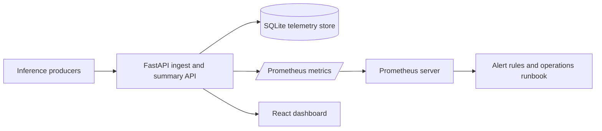
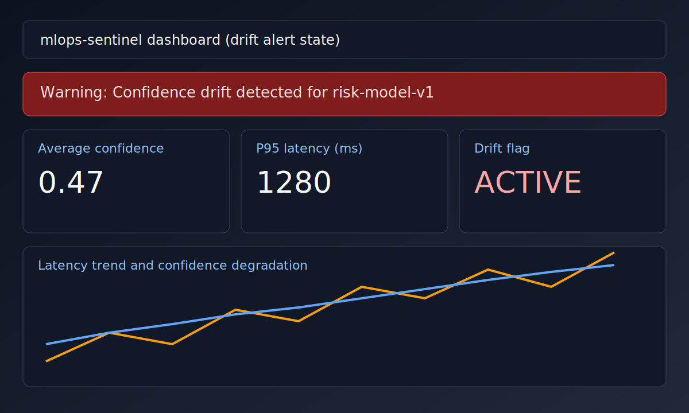

# mlops-sentinel

Production-grade observability service for model inference traffic.


## Results

> Replace placeholders with measured numbers from your latest load test.

| Metric | Baseline | Current | Notes |
| --- | --- | --- | --- |
| Ingest P95 latency | _TBD_ | _TBD_ | `/log` endpoint |
| Drift detection delay | _TBD_ | _TBD_ | events between drift onset and alert |
| Summary aggregate P95 | _TBD_ | _TBD_ | `/summary` endpoint |
| Dashboard initial load | _TBD_ | _TBD_ | first paint, local |

Reproduce: see `docs/TESTING.md` load-test section. Last measured: _YYYY-MM-DD_.

## What This Service Does

1. Ingests model inference events (`/log`).
2. Stores telemetry in SQLite for replay and export.
3. Exposes Prometheus metrics (`/metrics`).
4. Serves summary aggregates and drift signal (`/summary`).
5. Provides export APIs (`/export`) and health checks (`/health`).
6. Renders a live React dashboard for latency/distribution monitoring.

## Implemented Features

1. FastAPI backend with persistence, input validation, request IDs, and security headers.
2. Rate-limited ingestion path, optional API key auth, and configurable drift thresholding.
3. React dashboard with model filtering, KPI cards, and alert/error states.
4. Prometheus scrape compatibility and Docker Compose local stack.
5. Integration tests for core API flows.
6. Documentation baseline: API, deployment, testing, security, contributing, changelog.
7. Alert rule examples for latency and drift in `docs/ALERTING.md`.
8. Incident response runbook in `docs/OPERATIONS.md`.
9. Synthetic load generator for monitoring demonstrations in `backend/scripts/generate_demo_load.py`.

## Quick Start

Development stack:

```bash
docker compose up
```

Then open:

1. API health: http://127.0.0.1:8000/health
2. Dashboard: http://127.0.0.1:4173
3. Prometheus: http://127.0.0.1:9090

Production stack:

```bash
docker compose -f docker-compose.prod.yml up -d --build
```

Then open:

1. Dashboard: http://127.0.0.1:8080
2. Prometheus: http://127.0.0.1:9090

## Visual Evidence

Architecture overview:


## Architecture Snapshot



Dashboard preview:


Drift alert state preview:



## Dashboard Metric Descriptions

1. Average confidence: rolling confidence mean for selected model telemetry.
2. Drift flag: confidence-threshold breach signal used for alert routing.
3. Prediction distribution: class mix used to detect skew and imbalance.
4. Latency trend: operational latency behavior over recent inference traffic.

## Week 3 Monitoring Loop Additions

1. Added Prometheus alert examples for warning and critical latency thresholds.
2. Added drift detection alert examples and metric-to-alert mapping.
3. Added incident response runbook for drift and latency events.
4. Added synthetic telemetry load script for demo and validation workflows.
5. Added pipeline handshake integration test coverage for ingest, summary, metrics, and export.

## Week 11 Measured Outcomes

Before and after outcomes are documented in `docs/WEEK11_MEASURED_OUTCOMES.md`.

## Service Endpoints

1. API: http://127.0.0.1:8000
2. Dashboard: http://127.0.0.1:4173
3. Prometheus: http://127.0.0.1:9090

Production endpoints:

1. Dashboard + API proxy: http://127.0.0.1:8080
2. Prometheus: http://127.0.0.1:9090

## Local Development

Backend:

```bash
cd backend
# Python 3.12 is recommended for local setup.
python -m venv .venv
# Windows PowerShell: .\\.venv\\Scripts\\Activate.ps1
# macOS/Linux: source .venv/bin/activate
pip install -r requirements.txt
uvicorn app.main:app --reload --host 0.0.0.0 --port 8000
```

Optional backend security env vars:

```bash
MLOPS_API_KEY=
MLOPS_RATE_LIMIT_PER_MINUTE=600
MLOPS_ALLOWED_HOSTS=*
MLOPS_MAX_PAYLOAD_BYTES=65536
MLOPS_GZIP_MINIMUM_SIZE=1024
MLOPS_ENABLE_HSTS=false
MLOPS_API_KEY_FILE=
```

Production deployment notes:

1. Use `docker-compose.prod.yml` for immutable production images and reverse-proxied API traffic.
2. Prefer file-based secret loading with `MLOPS_API_KEY_FILE` (or `MLOPS_API_KEY_SECRET_FILE` for compose secret mount) and restrict `MLOPS_CORS_ORIGINS` and `MLOPS_ALLOWED_HOSTS` before deployment.
3. Set `MLOPS_ENABLE_HSTS=true` only when TLS termination is active.
4. Keep local secret files in `secrets/` and never commit secret values.

Frontend:

```bash
cd frontend
npm ci
npm run dev -- --host 0.0.0.0 --port 4173
```

Synthetic telemetry load generation:

```bash
cd backend
python scripts/generate_demo_load.py --base-url http://127.0.0.1:8000 --model-name risk-model-v1 --events 120 --drift-ratio 0.35
```

This script generates controlled low-confidence and high-latency events to exercise dashboard drift and alert paths.

## Testing

Core validation commands:

```bash
# backend
cd backend
pytest -q

# frontend
cd ../frontend
npm run build
```

Extended release-grade checks are documented in `docs/TESTING.md` and `docs/OPERATIONS.md`.

## Production Verification

Run these checks before release tags:

```bash
# backend
cd backend
python -m pip install --upgrade pip
pip install -r requirements.txt
python -m compileall -q app tests
python -m pip check
pytest -q --maxfail=1
pip-audit -r requirements.txt --progress-spinner off

# frontend
cd ../frontend
npm ci
npm run build
npm audit --omit=dev --audit-level=high
```

Expected outcome:

1. Backend tests pass without failures.
2. Frontend production build succeeds.
3. Dependency audits return no high-risk blockers.

## Release Artifacts

Version tags `v*.*.*` trigger `.github/workflows/release.yml` and publish:

1. GitHub Release notes and frontend bundle artifact.
2. Backend image: `ghcr.io/<owner>/mlops-sentinel-backend:<tag>`.
3. Frontend image: `ghcr.io/<owner>/mlops-sentinel-frontend:<tag>`.

## Quality and Security

1. Run backend tests: `cd backend && pytest -q`
2. Run frontend build: `cd frontend && npm run build`
3. Review security policy: `SECURITY.md`
4. Review API contract: `docs/API.md`
5. Review deployment guide: `docs/DEPLOYMENT.md`
6. Review collaboration context: `.claude/CLAUDE.md`
7. Review release workflow: `.github/workflows/release.yml`
8. Review alert examples: `docs/ALERTING.md`
9. Review incident runbook: `docs/OPERATIONS.md`

## Limitations

1. SQLite is single-node friendly and requires durable-volume planning for scale.
2. Frontend polling is fixed-interval and can be optimized with adaptive refresh.

## Roadmap

1. Add WebSocket/SSE dashboard mode to reduce polling overhead.
2. Add retention and compaction controls for long-running telemetry datasets.
3. Add optional SLO alert bundle for latency and drift anomaly thresholds.
